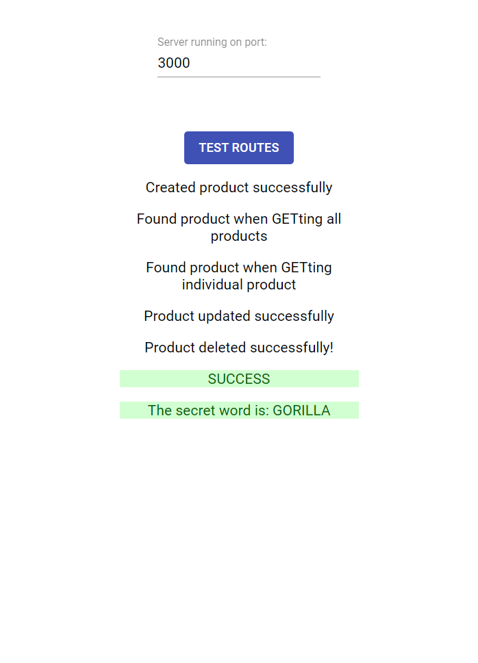

# Go-Fullstack-FR-Quiz
Savez-vous implémenter le CRUD ? Compétences évaluées Créer une API REST avec Node, Express et MongoDB Description Ce quiz est en fait un réel cas pratique, dans lequel vous aurez l'opportunité de tester vos compétences en codant !

<h2> Chapitre 12. QUIZ. Savez-vous implémenter le CRUD ? </h2>

  <b>Compétences évaluées</b>
  Créer une API REST avec Node, Express et MongoDB
  
  <b>Description</b>
  Ce quiz est en fait un réel cas pratique, dans lequel vous aurez l'opportunité de tester vos compétences en codant !

  Pour pouvoir répondre correctement, il vous faudra créer une API fonctionnelle comme nous venons de le faire pendant le cours. 
  Votre API devra être connectée à une base de données, car les différentes opérations CRUD seront testées et vérifiées !

  Vous allez créer une API basique pour une boutique en ligne qui permet de créer, lire, modifier et supprimer des produits ( Product ). 
  
  Les Product auront quatre champs obligatoires :

    · name : le nom du produit, de type String ;
    · description : la description du produit, de type String ;
    · price : le prix du produit, de type Number ;
    · inStock : si le produit est en stock, de type Boolean.
  
  Vous allez implémenter cinq routes :

    <b>GET:</b> /api/products
      Retournera tous les produits sous la forme{ products: Product[] }
    <b>GET:</b> /api/products/:id
      Retournera le produit avec le_id fourni sous la forme { product: Product }
    <b>POST:</b> /api/products
      Créera un nouveau Product dans la base de données.
      Le corps de la requête a pour forme :
      {
          "name": string,
          "description": string,
          "price": number,
          "inStock": boolean
      }
      Il retournera le Product ainsi créé (y compris son champ _id ), sous la forme{ product: Product }.

      La Promise retournée par la méthode save() de votre modèle Mongoose reçoit le produit créé :

      product.save()
      .then(product => ... ... .json({ product }))
      .catch(error => ... ...)
    <b>PUT:</b> /api/products/:id
      Modifiera le produit avec le _id fourni selon les données envoyées dans le corps de la requête.
      Le corps de la requête a pour forme :
      {
          "name": string,
          "description": string,
          "price": number,
          "inStock": boolean
      }
      Retournera un objet de la forme{ message: 'Modified!' }
    <b>DELETE :</b> /api/products/:id
      Supprimera le produit avec le _id fourni.
      Retournera un objet de la forme { message: 'Deleted!' }
      
  Votre API devra tourner sur votre machine locale en localhost (de préférence en port 3000, mais l'application front-end vous permet de modifier ce port si besoin) et accepter les requêtes HTTP venant de n'importe quelle origine (n'oubliez pas la configuration CORS !).

  Pour tester votre API, vous allez installer une mini-application front-end. Clonez le repo avec le code frontend sur ce lien.

  Depuis le dossier cloné, exécutez npm install puis npm start . Vous devriez voir s'ouvrir une fenêtre de navigateur comme celle-ci :
  
  Voir: https://openclassrooms.com/fr/courses/6390246-passez-au-full-stack-avec-node-js-express-et-mongodb/exercises/3732
  Front end app
  Application front-end
  
  Si votre serveur tourne, cliquez sur TEST ROUTES pour lancer les tests. 
  Ces tests vous permettront de vérifier que vous avez bien réussi à implémenter les routes demandées, et donc de valider ce quiz ! 
  Vous verrez apparaître des messages de succès (ou d'erreur) selon que l'application a réussi à faire fonctionner votre API ou non.

  Si votre navigateur s'ouvre avec une erreur 404, attendez quelques secondes et faites un refresh.

  Parfois, lors de la première tentative après le lancement de l'application, celle-ci émet une erreur même si l'API fonctionne. 
  Recliquez sur TEST ROUTES. S'il y a toujours une erreur, il est probable qu'elle vienne de votre API.

  <b>Question 1</b>
  Quand tout fonctionnera bien, l'application de test affichera un mot secret. Quel est ce mot secret ? Sélectionnez-le dans la liste ci-dessous :

        · GIRAFFE

        · ELEPHANT

        ✅ GORILLA

        · ZEBRA

